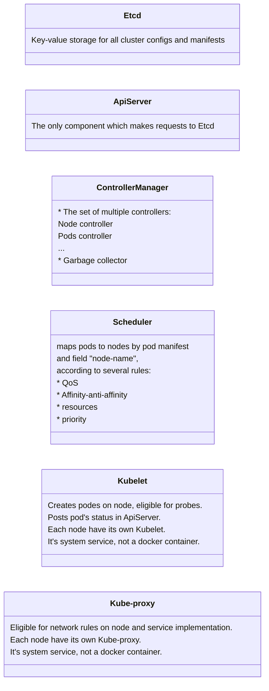

# K8s Components Scheme



# User Settings

**Enable kubectl autocomplete in zsh**

```bash
# Add the following to your .zshrc file
echo 'source <(kubectl completion zsh)' >>~/.zshrc
# Apply changes
source ~/.zshrc
```

**Configure minikube on Mac M1 with qemu and socket_vmnet instead of docker to prevent issues with ingress:**
```bash
# install and start socket_vmnet
brew install socket_vmnet
HOMEBREW=$(which brew) && sudo ${HOMEBREW} services start socket_vmnet
#restart minikue cluster
minikube delete
minikube start --driver qemu --network socket_vmnet
```